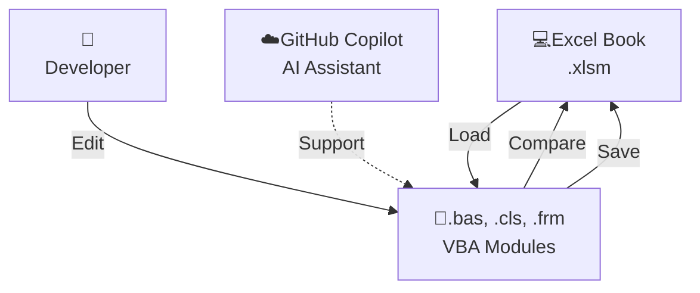

## Excel VBA

VS Code で Excel VBA を開発するための拡張機能です。Excel を開いておくだけで動作します。デバッグには対応していません。

**主な利点：**

- VS Code の豊富な拡張機能とシンタックスハイライト
- バージョン管理（Git）との統合
- 強力な検索・置換機能
- カスタマイズ可能なキーバインド
- GitHub Copilot などの生成AI アシスタントと統合可能

## 機能

| 機能                            | 説明                                                            |
| ------------------------------- | --------------------------------------------------------------- |
| **Open Excel Book**             | ファイルエクスプローラーから Excel ファイルを開きます。         |
| **Load VBA from Excel Book**    | ブックファイルから VBA ファイル（.bas, .cls, .frm）を取り出す。 |
| **Save VBA to Excel Book**      | VS Code で編集した VBA ファイルをブックファイルに保存します。   |
| **Compare VBA with Excel Book** | VS Code で編集したコードとブックファイルの状態を比較する。      |

## 準備

### マクロセキュリティ設定

拡張機能が Excel の VBA モジュールにアクセスするための設定をします。

1. Excel を開く
2. **ファイル** → **オプション** → **セキュリティセンター（トラストセンター）** を選択
3. **セキュリティセンターの設定（トラストセンターの設定）** をクリック
4. **マクロのセキュリティ** セクションで以下を確認：
   - **VBA プロジェクトオブジェクトモデルへのアクセスを信頼する** にチェックを入れる
5. **OK** をクリックして設定を保存

## 使い方

ファイルエクスプローラーでブックファイルを右クリック、またはエディタタイトルのアイコンをクリックして実行します。

### Excel ファイルを開く

1. ファイルエクスプローラーでブックファイルを右クリック
2. 「Open Excel Book」を選択
3. Excel でファイルが開く

### VBA をロードする

1. Excel で編集対象のブックファイルを開く
2. VS Code のファイルエクスプローラーでブックファイルを右クリック
3. 「Load VBA from Excel Book」を選択
4. ブックファイルと同じ名前のフォルダが作成される
   - 例：`MyBook.xlsm` → `MyBook_xlsm` フォルダ

### VBA を編集する

フォルダ内の VBA ファイル（.bas, .cls, .frm）を VS Code で編集。

### 差異を確認する

1. ファイルエクスプローラーでブックファイルを右クリック
2. 「Compare VBA with Excel Book」を選択
3. ブックファイルとの差異が表示される

### VBA を保存する

1. ファイルエクスプローラーでブックファイルを右クリック
2. 「Save VBA to Excel Book」を選択
3. 編集内容がブックファイルに保存される

## その他

### Git との連携

Excel ブックが壊れた場合に備えて Git と連携してください。

### ファイルエンコード

VBA ファイル（.bas, .cls, .frm）は Shift_JIS で開く。日本語を含む多言語文字に対応。

### フォーム リソースファイル（.frx）について

フォーム（.frm）と対応する .frx ファイル（リソースファイル）は自動生成される。.frx を削除すると、フォームは保存できない。
