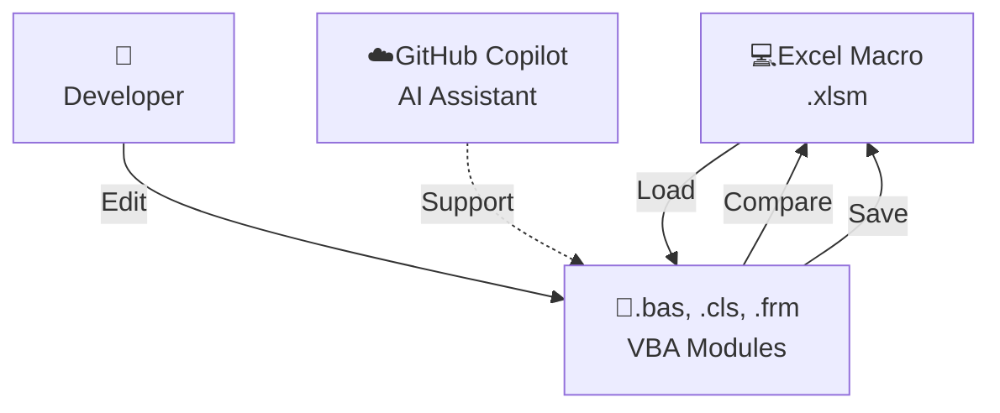

## Excel VBA

VS Code で Excel VBA を開発するための拡張機能です。Excel を開いておくだけで動作します。デバッグには対応していません。

**主な利点：**

- VS Code の豊富な拡張機能とシンタックスハイライト
- バージョン管理（Git）との統合
- 強力な検索・置換機能
- カスタマイズ可能なキーバインド
- GitHub Copilot などの生成AI アシスタントと統合可能

## 機能

| 機能                                | 説明                                                                                   |
| ----------------------------------- | -------------------------------------------------------------------------------------- |
| **Open Excel Macro**                | ファイルエクスプローラーから Excel ファイルを開きます。                                |
| **Load VBA from Excel Macro**       | マクロファイルから VBA ファイル（.bas, .cls, .frm）を取り出す。                        |
| **Save VBA to Excel Macro**         | VS Code で編集した VBA ファイルをマクロファイルに保存します。                          |
| **Compare VBA with Excel Macro**    | VS Code で編集したコードとマクロファイルの状態を比較する。                             |
| **Load CustomUI from Excel Add-in** | アドインファイル（.xlam）から CustomUI（customUI.xml, customUI14.xml）をエクスポート。 |
| **Save CustomUI to Excel Add-in**   | VS Code で編集した CustomUI をアドインファイル（.xlam）に保存。                        |

## 準備

### マクロセキュリティ設定

拡張機能が Excel の VBA モジュールにアクセスするための設定をします。

1. Excel を開く
2. **ファイル** → **オプション** → **セキュリティセンター（トラストセンター）** を選択
3. **セキュリティセンターの設定（トラストセンターの設定）** をクリック
4. **マクロのセキュリティ** セクションで以下を確認：
   - **VBA プロジェクトオブジェクトモデルへのアクセスを信頼する** にチェックを入れる
5. **OK** をクリックして設定を保存

## 使い方

ファイルエクスプローラーでマクロファイルを右クリック、またはエディタタイトルのアイコンをクリックして実行します。

### Excel ファイルを開く

1. ファイルエクスプローラーでマクロファイルを右クリック
2. 「Open Excel Macro」を選択
3. Excel でファイルが開く

### VBA をロードする

1. Excel で編集対象のマクロファイルを開く
2. VS Code のファイルエクスプローラーでマクロファイルを右クリック
3. 「Load VBA from Excel Macro」を選択
4. マクロファイルと同じ名前のフォルダが作成される
   - 例：`MyMacro.xlsm` → `MyMacro_xlsm` フォルダ

### VBA を編集する

フォルダ内の VBA ファイル（.bas, .cls, .frm）を VS Code で編集。

### 差異を確認する

1. ファイルエクスプローラーでマクロファイルを右クリック
2. 「Compare VBA with Excel Macro」を選択
3. マクロファイルとの差異が表示される

### VBA を保存する

1. ファイルエクスプローラーでマクロファイルを右クリック
2. 「Save VBA to Excel Macro」を選択
3. 編集内容がマクロファイルに保存される

### CustomUI をロードする（.xlam のみ）

1. アドインファイル（.xlam）をファイルエクスプローラーで右クリック
2. 「Load CustomUI from Excel Add-in」を選択
3. アドインファイルと同じ名前のフォルダが作成される
   - 例：`MyAddin.xlam` → `MyAddin_customUI` フォルダ
   - CustomUI XMLファイル（`customUI.xml`, `customUI14.xml`）が直接フォルダ内に抽出される

### CustomUI を編集する

フォルダ内の CustomUI XMLファイル（customUI.xml, customUI14.xml）を VS Code で編集。

### CustomUI を保存する（.xlam のみ）

1. ファイルエクスプローラーでアドインファイル（.xlam）を右クリック
2. 「Save CustomUI to Excel Add-in」を選択
3. 編集内容がアドインファイルの CustomUI に保存される

## その他

### アクセスブロック解除

ネットからダウンロードしたファイルはアクセスブロックの解除が必要です。

### Git との連携

Excel マクロが壊れた場合に備えて Git と連携してください。

### ファイルエンコード

VBA ファイル（.bas, .cls, .frm）は Shift_JIS で開く。日本語を含む多言語文字に対応。

### CustomUI

CustomUI（Ribbon UI）機能は .xlam（アドイン）ファイルのみでサポートされています。.xlsm ファイルでは使用できません。

### フォーム リソースファイル（.frx）

フォーム（.frm）と対応する .frx ファイル（リソースファイル）は自動生成される。.frx を削除すると、フォームは保存できない。

### 半角空白を含むパス

半角空白を含むパスには対応していません。
