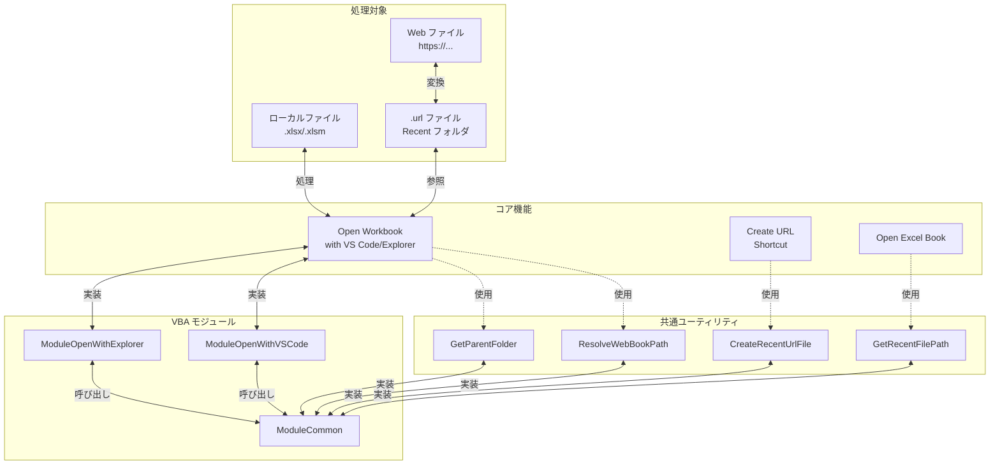

# クラウド対応・その他機能仕様書

## 機能関連図



## 概要

クラウドホストの Excel ファイルをサポートする機能、およびその他の補助機能です。

## 機能一覧

1. **Create URL Shortcut** - クラウドホストの Excel ファイル用 URL ショートカットを作成
2. **Open Excel Book** - Excel ファイルを Excel で開く
3. **Open Workbook with VS Code / Explorer** - アクティブなワークブックを VS Code またはエクスプローラで開く（Web 対応）

---

## 1. Create URL Shortcut

### 概要

OneDrive / SharePoint にホストされている Excel ファイルのダミー URL ショートカット（.url）を作成し、ローカルの VBA / CSV / CustomUI 管理を可能にします。

### 用途

**クラウドホストファイルの問題**

```
OneDrive/SharePoint の Excel ファイル
    ↓
ローカルコピーができない（古くなる）
    ↓
バージョン管理ができない
    ↓
VBA コードの管理が困難
```

**解決方法**

```
URL ショートカット (.url)
    ↓
VBA / CSV / CustomUI フォルダを作成
    ↓
バージョン管理に追加
    ↓
シームレスに VBA コードを編集
```

### 仕組み

**ショートカットファイル**

```
file.url
  ↓
[InternetShortcut]
URL=https://...
```

拡張機能がこのファイルを検出すると、アクティブな Excel ブックを処理対象として使用します。

### 入力仕様

**前提条件**

- OneDrive / SharePoint の Excel ファイルが Excel で開かれている
- 複数ファイルを一括処理可能

### 処理フロー

1. 処理対象の Excel ファイルを Excel で開く（複数可）
2. コマンドパレット（Ctrl+Shift+P）を開く
3. 「Create URL Shortcut」を実行
4. ショートカット作成処理
   - Excel で開かれている全ブックをスキャン
   - URL（フルパス）を抽出
   - .url ファイルを作成
5. ワークスペースフォルダに .url ファイルが作成される

### 出力ファイル形式

```
{ファイルサーバー上のファイル名}.url
```

**例**

```
Workspace/
  ├── 設計書.url          (https://...設計書.xlsx)
  ├── 企画.url            (https://...企画.xlsm)
  ├── 設計書.bas/         (.url から自動作成)
  ├── 設計書.csv/
  ├── 設計書.xml/
  └── 企画.bas/
```

### .url ファイルの内容

```ini
[InternetShortcut]
URL=https://fujitsu.sharepoint.com/sites/...

; Optional
WorkingDirectory={workspace_folder}
IconFile={extension_path}\icon.ico
```

### パス解析の仕組み

**通常ファイル選択**

```
test.xlsx を右クリック → Load VBA
  ↓
test.xlsx を直接使用
  ↓
test.bas フォルダ作成
```

**URL ショートカット選択**

```
test.url を右クリック → Load VBA
  ↓
test.xlsx を検索（同じフォルダ）
  ↓
見つからない場合、test.url が示す Excel を使用
  ↓
test.bas フォルダ作成
```

### VBA/CSV/CustomUI ファイルの自動検出

```
test.url 選択時:
  1. 同じフォルダで test.xlsx を検索
  2. 見つかれば使用（ローカルコピー）
  3. 見つからなければ、アクティブな Excel ブックを使用
```

### 実装詳細

**メイン処理**: `src/commands/createUrlShortcut.ts`

```typescript
export async function createUrlShortcutAsync(context: CommandContext);
```

**PowerShell**: `bin/Create-UrlShortcuts.ps1`

処理内容：

1. Excel.Workbooks を列挙
2. 各ブックの Full Path を取得
3. .url ファイル生成
4. ワークスペースに保存

### セキュリティ

**認証情報の扱い**

- URL に認証情報は含まれません
- SharePoint の認証は OS のクレデンシャルマネージャーを使用
- .url ファイルはテキストベースで保存

## 2. Open Excel Book

### 概要

VS Code から Excel ファイルを Excel アプリケーションで開く機能です。

### 入力仕様

**対象ファイル**

```
.xlsx, .xlsm, .xlam  - Excel ブック
.url                 - URL ショートカット（クラウドホスト）
.csv                 - CSV ファイル（Excel で開く）
.bas, .cls, .frm     - VBA ファイル（対応 Excel ファイルで開く）
.xml                 - XML ファイル（対応 Excel ファイルで開く）
```

### 処理フロー

1. VS Code のエクスプローラーでファイルを選択
2. 右クリックメニュー、またはエディタタイトルから「Open Excel Book」を実行
3. 開く処理
   - ファイルタイプに応じ、関連ファイルを検出
   - Excel で開く

### ファイルタイプ別処理

**Excel ブック直接オープン**

```
test.xlsx → Excel.exe test.xlsx
```

**VBA / CSV / XML ファイル**

```
test.bas/Module1.bas を選択
  ↓
test.xlsx を検出
  ↓
Excel.exe test.xlsx を実行
```

**URL ショートカット**

```
test.url を選択
  ↓
test.xlsx をローカルで検索
  ↓
見つからない場合、Web ブラウザで URL を開く
```

### 実装詳細

**メイン処理**: `src/commands/openBook.ts`

```typescript
export async function openBookAsync(bookPath: string, context: CommandContext);
```

**PowerShell**: bin/Open-Book.ps1 相当

処理内容：

1. ファイルパス解析（pathResolution.ts）
2. 関連 Excel ファイルを検出
3. Excel.exe を起動
4. ファイルをオープン

### パスの自動解析

ユーティリティ(`src/utils/pathResolution.ts`)が以下を自動判定：

```
入力: Module1.bas
  ↓
親フォルダ: test.bas
  ↓
対応ファイル: test.xlsx, test.xlsm, test.xlam
  ↓
見つけたファイルを開く
```

## ファイル拡張子と自動検出

| 入力ファイル    | 検出ロジック                  | 開くファイル |
| --------------- | ----------------------------- | ------------ |
| test.xlsx       | 直接                          | test.xlsx    |
| test.bas/\*.bas | 親フォルダ「.bas」→ test.xlsx | test.xlsx    |
| test.csv/\*.csv | 親フォルダ「.csv」→ test.xlsx | test.xlsx    |
| test.xml/\*.xml | 親フォルダ「.xml」→ test.xlam | test.xlam    |
| test.url        | ショートカット → test.xlsx    | test.xlsx    |

## エラーハンドリング

| エラー条件                 | 対応                     |
| -------------------------- | ------------------------ |
| Excel が起動していない     | 自動起動                 |
| ファイルが見つからない     | エラーメッセージ表示     |
| Excel がファイルをロック中 | エラーメッセージ表示     |
| URL ショートカットが無効   | ブラウザで開くか、エラー |

## パフォーマンス

| 操作                    | 処理時間                 |
| ----------------------- | ------------------------ |
| URL ショートカット作成  | < 1 秒（複数ファイル）   |
| ファイルを Excel で開く | 1-5 秒（Excel 起動含む） |

## 制限事項

1. URL ショートカットは読み取り専用
2. クラウドホストのファイルは常にサーバーから読み込む
3. オフライン時は利用不可
4. SharePoint の権限は OS 認証を使用

## 3. Open Workbook with VS Code / Explorer

### 概要

アクティブなワークブックを VS Code またはエクスプローラで開く機能です。クラウドホストの Excel ファイルに対応し、自動的に URL ショートカットを検出・作成します。

### 用途

**シナリオ 1: ローカルファイルを開く場合**

```
Excel でローカルファイルを編集中
    ↓
リボン「Open with VS Code」をクリック
    ↓
そのファイルが保存されているフォルダで VS Code を起動
```

**シナリオ 2: クラウドホストファイルを開く場合**

```
Excel で OneDrive/SharePoint ファイルを編集中
    ↓
リボン「Open with Explorer」をクリック
    ↓
自動的に .url ファイルを検出または作成
    ↓
対応するフォルダをエクスプローラで開く
```

### 機能

#### Open with VS Code

- **リボン配置**: カスタム UI のボタン
- **動作対象**: アクティブなワークブック
- **出力**: VS Code でワークブックのフォルダを開く
- **Web 対応**: URL ファイルを自動検出・作成

#### Open with Explorer

- **リボン配置**: カスタム UI のボタン
- **動作対象**: アクティブなワークブック
- **出力**: エクスプローラでワークブックのフォルダを開く
- **Web 対応**: URL ファイルを自動検出・作成

### 仕組み

#### パス解決ロジック

```
ActiveWorkbook.FullName
    ↓
[URL か確認]
    ↓
URL の場合:
  - Recent フォルダから .url ファイルを検索
  - 見つからなければ自動作成
  - .url ファイルのフォルダを取得
    ↓
ローカルファイルの場合:
  - ファイルのフォルダを直接取得
    ↓
フォルダを VS Code / Explorer で起動
```

### ご利用例

**例 1: ローカル VBA ファイルを編集**

```
1. C:\project\workbook.xlsm を Excel で開く
2. リボン「Open with VS Code」を押す
3. C:\project\ フォルダで VS Code が起動
4. VBA, CSV, CustomUI ファイルを編集可能
```

**例 2: OneDrive の VBA ファイルを編集**

```
1. https://onedrive.com/...project.xlsm を Excel で開く
2. リボン「Open with Explorer」を押す
3. 自動的に Recent フォルダに project.xlsm.url が作成される
4. %APPDATA%\Microsoft\Office\Recent\ をエクスプローラで開く
5. project.xlsm.bas/ フォルダで VBA を管理
```

### エラーハンドリング

| 状況                            | 動作                 |
| ------------------------------- | -------------------- |
| ワークブックが開かれていない    | 警告メッセージ表示   |
| ファイルが保存されていない      | メッセージ表示       |
| Recent フォルダへのアクセス失敗 | エラーメッセージ表示 |
| VS Code / Explorer 起動に失敗   | エラーメッセージ表示 |

### 内部実装

**共通関数** (ModuleCommon.bas)

- `ResolveWebBookPath()` - Web ファイルパスの解決
  - HTTP/HTTPS 検出
  - Recent フォルダの .url ファイル検索
  - .url ファイルの自動作成

- `GetParentFolder()` - ファイルパスから親フォルダを取得

- `CreateRecentUrlFile()` - Recent フォルダに .url ファイルを作成

**VBA モジュール**

- `ModuleOpenWithVSCode.bas` - VS Code 連携
- `ModuleOpenWithExplorer.bas` - エクスプローラ連携
