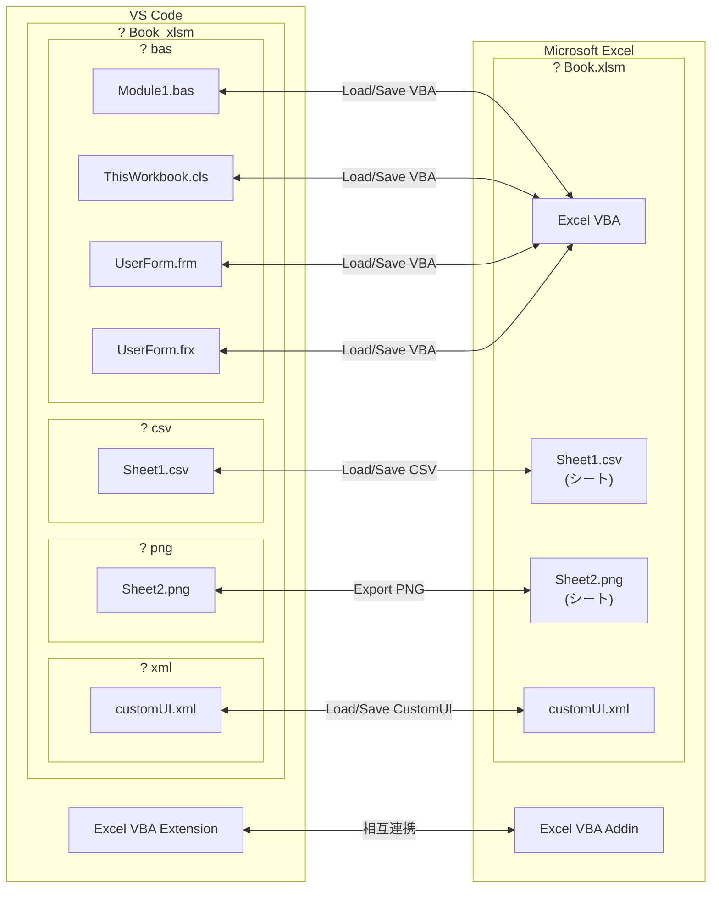

# Excel VBAをVS Codeで編集する - Excel VBA Extension

## はじめに

Excel VBAをVS Codeで編集するための拡張機能を作成しました。
何番煎じの拡張機能か分かりませんが自分が使いやすいように作ってみました。

**既存の拡張機能**

- [XVBA - Live Server VBA](https://marketplace.visualstudio.com/items?itemName=local-smart.excel-live-server)
- [excel-vba-sync](https://marketplace.visualstudio.com/items?itemName=9kv8xiyi.excel-vba-sync)
- [Barretta](https://marketplace.visualstudio.com/items?itemName=Mikoshiba-Kyu.vscode-barretta)

## 主な利点

- Excel VBAをVS Codeから編集可能です。
- Excel VBAをGitでのバージョン管理可能です。
- Excel VBAを生成AIで支援可能です。
- 設定無しですぐに利用可能です。
- 同時にインストールされるExcel VBA AddinによりExcel側からも操作可能です。

## 機能

- VS Code - Excel VBA Extension
  - **Load VBA / Save VBAA** - VBAを読込・編集・保存ができます。
  - **Load CSV / Save CSV** - CSV読込・編集・保存ができます。
  - **Load CustomUI / Save CustomUI** - 読込・編集・保存ができます。
  - **Run Sub** - VS CodeからSub プロシージャを実行できます。
  - **Compare VBA / Compare CSV** - エクスポートしたファイルとExcel VBA、Excel CSVシートの差分を確認できます。
- Excel - Excel VBA Addin
  - **Open with VS Code** - Excel からフォルダを VS Code で開きます。
  - **Open with Explorer** - Excel からフォルダを Explorer で開きます。
  - **Load VBA / Save VBA** - Excel からExcel VBA を読込・保存できます。
  - **Load CSV / Save CSV** - Excel からシートを CSV として読込・保存できます。
  - その他機能
    - **Graph Paper** - 選択シートを方眼紙にします。
    - **Snap to Grid** - オブジェクトをグリッドに吸着させます。
    - **One Side Connector** - 片側のみ接続されていないコネクタを検出します。
    - **Export PNG** - シートを画像でエクスポート

## 機能関連図

## インストールとセットアップ

### ステップ 1：VS Codeで拡張機能のインストール

VS Code で拡張機能をインストールします。

1. VS Code を起動
2. `Ctrl+Shift+X` で拡張機能を検索
3. `Excel VBA Extension`を入力
4. インストール
   - Excel VBA Extensionの有効化処理でExcel VBA AddinがOfficeアドインフォルダにコピーされます。  
     以後、VS Codeが起動されるたびにExcel VBA AddiがOfficeアドインフォルダにコピーされます。

### ステップ 2：Excel の設定

Excel VBA ExtensionからExcelにアクセスできるようにします。

1. Excel を起動
2. [ファイル] → [オプション] → [トラストセンター]
3. [トラストセンターの設定]をクリック
4. [マクロ設定]で[VBA プロジェクト オブジェクト モデルへのアクセスを信頼する]をチェック
5. [OK] をクリック

### ステップ 3：開発タブの表示

Excel VBA Addinを有効化するためにExcel の開発タブを表示します。

1. [ファイル] → [オプション] をクリック
2. [リボンのユーザー設定] をクリック
3. 右側の [メインタブ] リストで [開発] にチェックを入れる
4. [OK] をクリック

### ステップ 4：Excel VBA Addin の有効化

続いて Excel VBA Addin を有効にします。

1. [開発] タブから [Excel アドイン] を選択
2. [参照] をクリックして `Excel-Vba-Addin` を選択
3. [OK] をクリック

以上でインストールとセットアップは完了です。

## 使用例

### 例 1：新規マクロファイルで開発を開始

1. Ctrl+Shift+P でコマンドパレットを開く
2. 「Excel: New Excel Book with CustomUI as Macro」を実行
3. ファイル名を入力
4. Excel ファイルと VBA フォルダが自動生成される

### 例 2：既存ファイルから VBA を抽出して Git 管理

1. コマンドパレット → 「Excel: Load VBA from Excel Book」
2. Excel ファイルを選択
3. VBA ファイルが抽出される
4. git add・git commit で管理開始

### 例 3：Sub プロシージャを実行

1. VS Code で VBA ファイルを開く
2. 実行対象の Sub の行にカーソルを置く
3. コマンドパレット → 「Excel: Run VBA Sub at Cursor」
4. Excel が実行する
