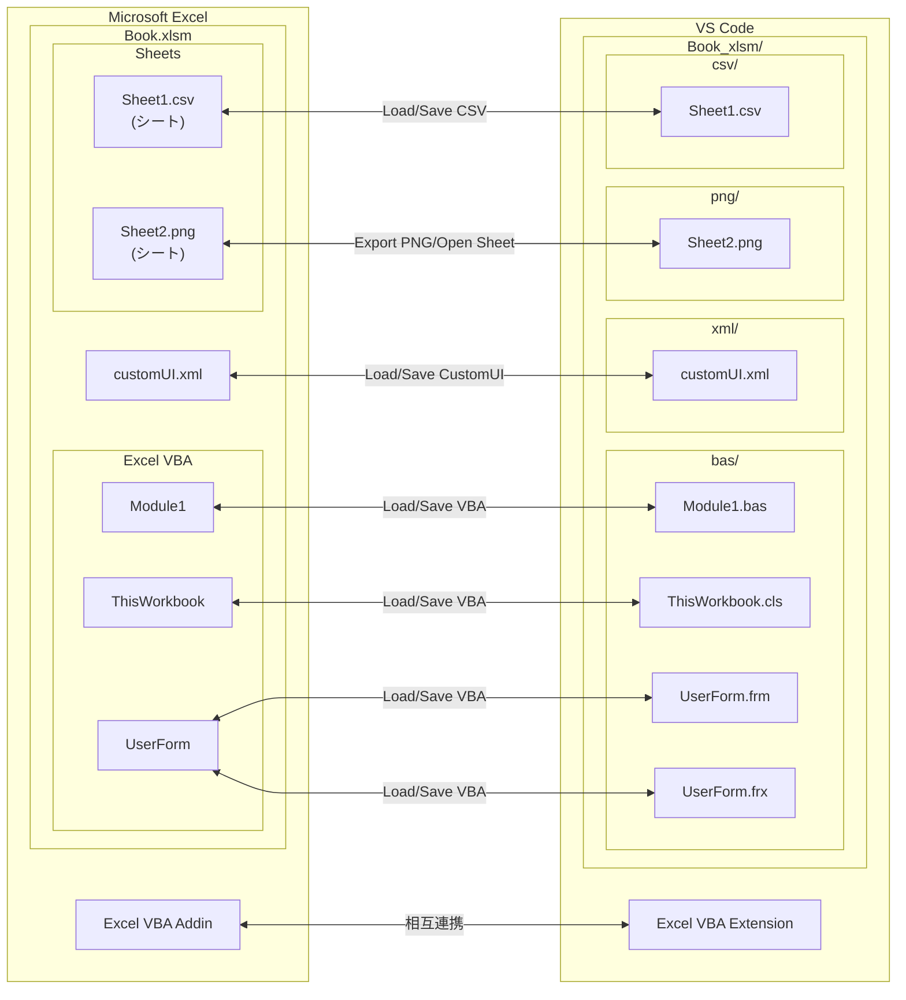

# Excel VBAをVS Codeで編集する - Excel VBA Extension

## はじめに

Excel VBAをVS Codeで編集するための拡張機能を作成しました。
何番煎じの拡張機能か分かりませんが自分が使いやすいように作ってみました。

**既存の拡張機能**

- [XVBA - Live Server VBA](https://marketplace.visualstudio.com/items?itemName=local-smart.excel-live-server)
- [excel-vba-sync](https://marketplace.visualstudio.com/items?itemName=9kv8xiyi.excel-vba-sync)
- [Barretta](https://marketplace.visualstudio.com/items?itemName=Mikoshiba-Kyu.vscode-barretta)

## 主な利点

- Excel VBAをVS Codeから編集可能です。
- Excel VBAをGitでのバージョン管理可能です。
- Excel VBAを生成AIで支援可能です。
- 拡張機能固有の設定無しですぐに利用可能です。
- 同時にインストールされるExcel VBA AddinによりExcel側からも操作可能です。

## 機能

- VS Code - Excel VBA Extension
  - **Load VBA / Save VBAA** - VBAを読込・編集・保存ができます。
  - **Load CSV / Save CSV** - CSV読込・編集・保存ができます。
  - **Load CustomUI / Save CustomUI** - 読込・編集・保存ができます。
  - **Run Sub** - VS CodeからSub プロシージャを実行できます。
  - **Compare VBA / Compare CSV** - エクスポートしたファイルとExcel VBA、Excel CSVシートの差分を確認できます。
- Excel - Excel VBA Addin
  - **Open with VS Code** - Excel からフォルダを VS Code で開きます。
  - **Open with Explorer** - Excel からフォルダを Explorer で開きます。
  - **Load VBA / Save VBA** - Excel からExcel VBA を読込・保存できます。
  - **Load CSV / Save CSV** - Excel からシートを CSV として読込・保存できます。
  - その他機能
    - **Graph Paper** - 選択シートを方眼紙にします。
    - **Snap to Grid** - オブジェクトをグリッドに吸着させます。
    - **One Side Connector** - 片側のみ接続されていないコネクタを検出します。
    - **Export PNG** - シートを画像でエクスポート

## 機能関連図

## インストールとセットアップ

### ステップ 1：VS Codeで拡張機能のインストール

VS Code で拡張機能をインストールします。

1. VS Code を起動
2. `Ctrl+Shift+X` で拡張機能を検索
3. `Excel VBA Extension`と入力
   
4. [] をクリック
   - Excel VBA Extensionの有効化処理でExcel VBA AddinがOfficeアドインフォルダにコピーされます。以後、VS Codeが起動されるたびにExcel VBA AddinがOfficeアドインフォルダにコピーされます。

### ステップ 2：Excel の設定

Excel VBA ExtensionからExcelにアクセスできるようにします。

1. Excel を起動
2. [ファイル] → [オプション] → [トラストセンター]
3. [トラストセンターの設定]をクリック
   
4. [マクロ設定]で[VBA プロジェクト オブジェクト モデルへのアクセスを信頼する]をチェック
   
5. [OK] をクリック

以上でインストールとセットアップは完了です。

## Excel VBA Extension 使用例

### 使用例 1：VS Codeで空のマクロファイルを作成する

1. `Ctrl+Shift+P` でコマンドパレットを開く
2. `Create: New File`を選択
3. `New Excel Book with CustomUI as Macro`を選択
   
4. ファイル名（拡張子無し）を入力（例：book）
5. `book.xlsm`が作成されるのでエクスプローラビューから選択
6. `book.xlsm`のエディタタイトルの`Open Excel Book`アイコンをクリック
   
7. `book.xlsm`のエディタタイトルの`Load VBA from Excel Book`アイコンをクリック
   
8. `ModuleSampleMacro.bas`のMsgBoxの出力文字列を修正
   
9. `ModuleSampleMacro.bas`のエディタタイトルの`Save VBA to Excel Book`アイコンをクリック
10. Excelのタブから`ButtonSampleMacro`をクリック
    

### 使用例 2：サブルーチンを修正してすぐに実行

1. `ModuleSampleMacro.bas`のMsgBoxの出力文字列を更に修正
2. `SampleMacro`サブルーチンの範囲にカーソルを置く
3. `ModuleSampleMacro.bas`のエディタタイトルの`Run VBA Sub at Cursor`アイコンをクリック
4. `SampleMacro`を実行

### 使用例 3：エクスポートしたファイルとの比較

1. `ModuleSampleMacro.bas`のMsgBoxの出力文字列を更に修正
2. `ModuleSampleMacro.bas`のエディタタイトルの`Compare VBA with Excel Book`アイコンをクリック
   

### 使用例 4：CustomUIを修正

1. `book.xlsm`のエディタタイトルの`Load CustomUI from Excel Book`をクリック
   
   
2. `customUI.xm`のタブ、グループ、ボタンのlabelを修正
   
3. `book.xlsm`を閉じる
4. `book.xlsm`のエディタタイトルの`Save CustomUI to Excel Book (Close Excel first)`をクリック
   
5. `book.xlsm`を開く
6. タブ、グループ、ボタンが変更されていることを確認
   

## 補足

### 対象データ種類別

- VBA
- Save VBAでは一旦すべてのモジュールを削除してから登録する。不慮の事故を避けるためLoad VBAしたファイルは構成管理すること
- VS Code側で.bas, .clsを追加してSave VBAすることは可能
- VS Code側で.frmを追加してSave VBAすることは不可能。.frmと.frxは一緒に登録することが必要なため
- CSV
- シート名が.csvで終わるとCSVシートとして扱われ、`Load CSV from Excel Book`, `Save CSV to Excel Book`の対象となる
- PNG
- シート名が.pngで終わるとPNGシートとして扱われ、`Export PNG from Excel Book`の対象となる
- CustomUI.xml
- CustomUI.xmlを登録済みの.xlsm / .xlamではCustomUIを`Load CustomUI from Excel Book`, `Save CustomUI from Excel Book`が可能
- 素の .xlsm / .xlamにはcustomUI.xmlは格納されていないため何らかの手段で登録するか、`New Excel Book with CustomUI as Macro`を使用すること

### Excelファイル種類別対応機能

| 機能                            | .xlsx | .xlsm | .xlam |
| ------------------------------- | ----- | ----- | ----- |
| `Load VBA from Excel Book`      | -     | ○     | ○     |
| `Save VBA to Excel Book`        | -     | ○     | ○(1)  |
| `Load CustomUI from Excel Book` | -     | ○     | ○     |
| `Save CustomUI to Excel Book`   | -     | ○     | ○     |
| `Load CSV from Excel Book`      | ○     | ○     | -     |
| `Save CSV to Excel Book`        | ○     | ○     | -     |
| `Export PNG from Excel Book`    | ○     | ○     | -     |

(1) .xlamのSave VBAでは直接保存できない。アドインのためOfficeアドインフォルダに保存しようとするため開発サイクルが回らない。VBエディタのツールバーから保存すること。

### 未説明機能

- Excel VBA Addinについては別途説明
