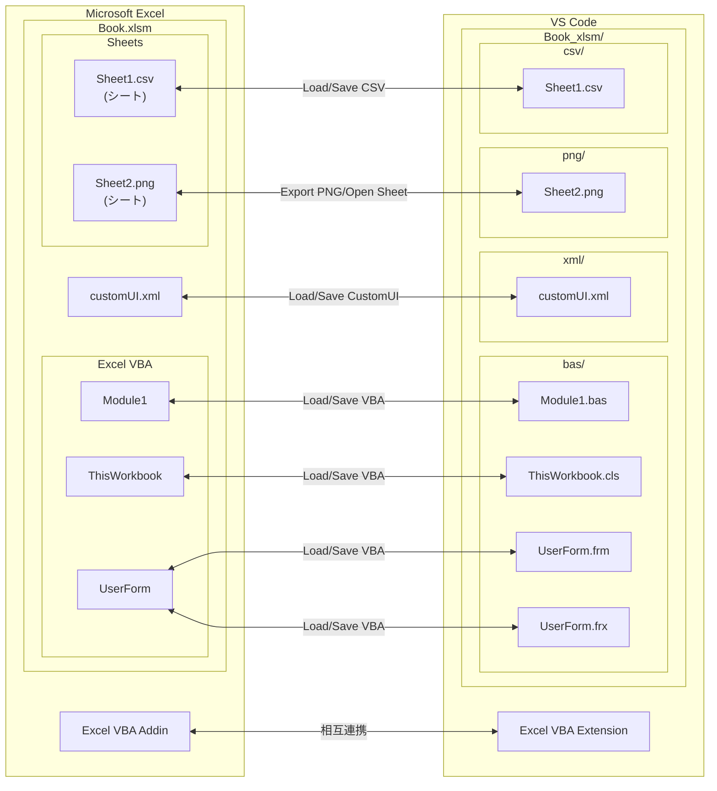

# Excel VBAをVS Codeで編集する - Excel VBA Extension

## はじめに

Excel VBAをVS Codeで編集するための拡張機能を作成しました。
何番煎じの拡張機能か分かりませんが自分が使いやすいように作ってみました。

**既存の拡張機能**

- [XVBA - Live Server VBA](https://marketplace.visualstudio.com/items?itemName=local-smart.excel-live-server)
- [excel-vba-sync](https://marketplace.visualstudio.com/items?itemName=9kv8xiyi.excel-vba-sync)
- [Barretta](https://marketplace.visualstudio.com/items?itemName=Mikoshiba-Kyu.vscode-barretta)

## 主な利点

- Excel VBAをVS Codeから編集可能です。
- Excel VBAをGitでのバージョン管理可能です。
- Excel VBAを生成AIで支援可能です。
- 拡張機能固有の設定無しですぐに利用可能です。
- 同時にインストールされるExcel VBA AddinによりExcel側からも操作可能です。

## 機能

- VS Code - Excel VBA Extension
  - **Load VBA / Save VBAA** - VBAを読込・編集・保存ができます。
  - **Load CSV / Save CSV** - CSV読込・編集・保存ができます。
  - **Load CustomUI / Save CustomUI** - 読込・編集・保存ができます。
  - **Run Sub** - VS CodeからSub プロシージャを実行できます。
  - **Compare VBA / Compare CSV** - エクスポートしたファイルとExcel VBA、Excel CSVシートの差分を確認できます。
- Excel - Excel VBA Addin
  - **Open with VS Code** - Excel からフォルダを VS Code で開きます。
  - **Open with Explorer** - Excel からフォルダを Explorer で開きます。
  - **Load VBA / Save VBA** - Excel からExcel VBA を読込・保存できます。
  - **Load CSV / Save CSV** - Excel からシートを CSV として読込・保存できます。
  - その他機能
    - **Graph Paper** - 選択シートを方眼紙にします。
    - **Snap to Grid** - オブジェクトをグリッドに吸着させます。
    - **One Side Connector** - 片側のみ接続されていないコネクタを検出します。
    - **Export PNG** - シートを画像でエクスポート

## 機能関連図

## インストールとセットアップ

### ステップ 1：VS Codeで拡張機能のインストール

VS Code で拡張機能をインストールします。

1. VS Code を起動
2. `Ctrl+Shift+X` で拡張機能を検索
3. `Excel VBA Extension`と入力
4. [インストール] をクリック
   - Excel VBA Extensionの有効化処理でExcel VBA AddinがOfficeアドインフォルダにコピーされます。以後、VS Codeが起動されるたびにExcel VBA AddinがOfficeアドインフォルダにコピーされます。

### ステップ 2：Excel の設定

Excel VBA ExtensionからExcelにアクセスできるようにします。

1. Excel を起動
2. [ファイル] → [オプション] → [トラストセンター]
3. [トラストセンターの設定]をクリック
4. [マクロ設定]で[VBA プロジェクト オブジェクト モデルへのアクセスを信頼する]をチェック
5. [OK] をクリック

以上でインストールとセットアップは完了です。

## Excel VBA Extension 使用例

### 使用例 1：VS Codeで空のマクロファイルを作成する

1. `Ctrl+Shift+P` でコマンドパレットを開く
2. `Create: New File`を選択
3. `Excel: New Excel Book with CustomUI as Macro`を選択
4. ファイル名を入力
5. .xlsmファイルが作成される
6. .xlxmファイルを選択してタイトルのアイコンをクリック

### 使用例 2：ブックに追加したCSVシートをファイルに出力する

1. コマンドパレット → 「Excel: Load CSV from Excel Book」
2. Excel ファイルを選択
3. CSV ファイルが抽出される
4. VS Code で CSV を編集
5. コマンドパレット → 「Excel: Save CSV to Excel Book」で Excel に保存

### 使用例 3：Sub プロシージャを実行

1. VS Code で VBA ファイルを開く
2. 実行対象の Sub の行にカーソルを置く
3. コマンドパレット → 「Excel: Run VBA Sub at Cursor」
4. Excel が実行する

## Excel VBA Addin 使用例
